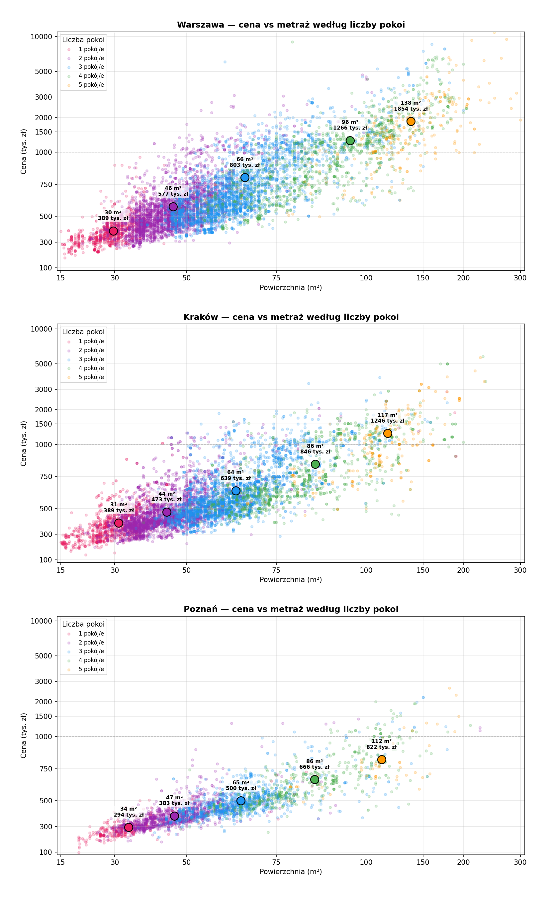
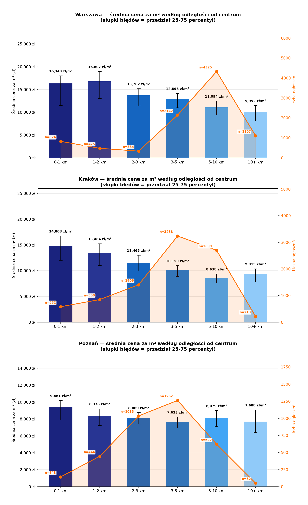
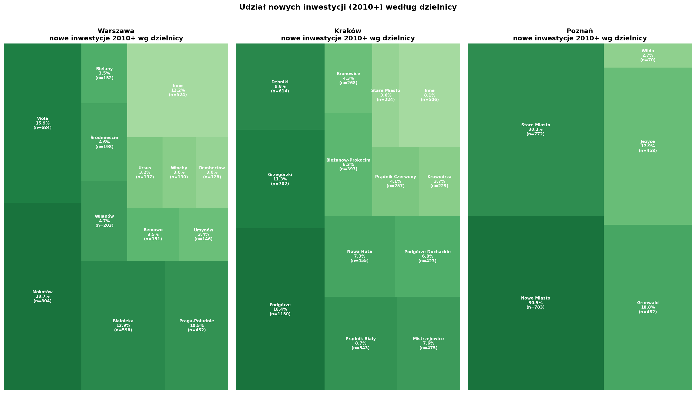

# Analiza cen mieszkań w Polsce 🏠

Projekt eksploracyjny oparty na danych z portali ogłoszeniowych, 
zebranych w 2020-2021 roku dla trzech miast Polski: 
Warszawy, Krakowa i Poznania.

## Dane

- **Źródło:** [House Prices in Poland - Kaggle](https://www.kaggle.com/datasets/dawidcegielski/house-prices-in-poland/data)
- **Okres scrapowania:** 2020-2021
- **Rekordy po czyszczeniu:** 21 905 z oryginalnych 23 764

## Czyszczenie danych

Czyszczenie było przeprowadzone świadomie, każda decyzja uzasadniona:

- Poprawiono błędne lata budowy (np. '70' -> '1970' dla Poznania na podstawie weryfikacji GPS)
- Poprawiono błędny metraż (8.8m² -> 88m² na podstawie analizy ceny za m²)
- Usunięto rekordy z niemożliwymi latami budowy, metrażem i cenami
- Usunięto duplikaty z uwzględnieniem piętra (te same mieszkania scrapowane wielokrotnie)
- Zastosowano osobne progi cenowe per miasto oparte na danych NBP za 2020/2021:
  - Warszawa: min. 4 500 zł/m²
  - Kraków: min. 3 500 zł/m²
  - Poznań: min. 3 000 zł/m²
- Usunięto rekordy z błędnymi współrzędnymi GPS (poza granicami Polski)
- Usunięto rekordy z nazwą województwa zamiast adresu (błąd scrapera)

## Analiza i wnioski

### Wykres 1 - Cena vs metraż według liczby pokoi

- Mieszkania 4- i 5-pokojowe w Warszawie mają znacznie większy metraż niż analogiczne 
  w Krakowie i Poznaniu. Może to świadczyć o wyższym popycie na duże mieszkania 
  z potencjałem podziału (np. wynajem pokoi) lub segment luksusowy.
- Poznań charakteryzuje się najmniejszym rozproszeniem cen - rynek jest bardziej 
  przewidywalny, co może ograniczać opłacalność flipperom i inwestorom.
- W Krakowie obserwujemy częste występowanie małych mieszkań (poniżej 25m²) Spośród badanych miast Kraków wyróżnia największy udział kamienic, które ze względu na dużą liczbę okien są najłatwiejsze do podziału na mikrokawalerki. 

### Wykres 2 - Cena za m² według odległości od centrum

- We wszystkich trzech miastach cena za m² spada wraz z odległością od centrum - 
  zgodnie z oczekiwaniami.
- W Warszawie strefa 1-2 km od centrum (Powiśle) jest droższa niż samo centrum. 
  Świadczy to o wysokim prestiżu tej dzielnicy wśród potencjalnych nabywców.
- Amplituda cen (przedział 25-75 percentyl) jest najmniejsza w Poznaniu, 
  co potwierdza poprzednią tezę o mniejszym zróżnicowaniu rynku.

### Wykres 3 - Nowe inwestycje według dzielnicy (2010+)

- Kraków odnotował 6 239 nowych inwestycji wobec 4 307 w Warszawie - o 45% więcej, 
  mimo że jest miastem znacznie mniejszym. Może to być efektem dynamicznego rozwoju 
  sektora IT/BPO w Krakowie po 2010 roku, który wygenerował duży popyt na mieszkania.

## Ograniczenia

- Brak daty scrapowania ogłoszeń - część rekordów może pochodzić sprzed 2020 roku
- Dane obejmują tylko 3 miasta
- Adresy dzielnic wyciągane automatycznie z pierwszego członu adresu - możliwe błędy klasyfikacji
- W przypadku Poznania podzial administracyjny mniej szczegółowy niz w przypadku Krakowa i Warszawy

## Technologie

- Python 3.11
- pandas, matplotlib, seaborn, squarify
- SQLite / DBeaver (eksploracja danych)
- Git / GitHub